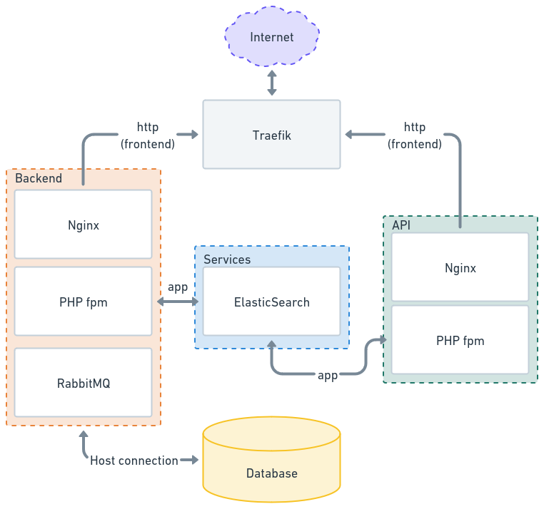

# Danish event database (version 2.x)

[![Woodpecker](https://img.shields.io/badge/woodpecker-prod|stg-blue.svg?style=flat-square&logo=data:image/svg+xml;base64,PHN2ZyB4bWxucz0iaHR0cDovL3d3dy53My5vcmcvMjAwMC9zdmciIHdpZHRoPSIyMiIgaGVpZ2h0PSIyMiI+PHBhdGggZmlsbD0iI2ZmZiIgZD0iTTEuMjYzIDIuNzQ0QzIuNDEgMy44MzIgMi44NDUgNC45MzIgNC4xMTggNS4wOGwuMDM2LjAwN2MtLjU4OC42MDYtMS4wOSAxLjQwMi0xLjQ0MyAyLjQyMy0uMzggMS4wOTYtLjQ4OCAyLjI4NS0uNjE0IDMuNjU5LS4xOSAyLjA0Ni0uNDAxIDQuMzY0LTEuNTU2IDcuMjY5LTIuNDg2IDYuMjU4LTEuMTIgMTEuNjMuMzMyIDE3LjMxNy42NjQgMi42MDQgMS4zNDggNS4yOTcgMS42NDIgOC4xMDdhLjg1Ny44NTcgMCAwMC42MzMuNzQ0Ljg2Ljg2IDAgMDAuOTIyLS4zMjNjLjIyNy0uMzEzLjUyNC0uNzk3Ljg2LTEuNDI0Ljg0IDMuMzIzIDEuMzU1IDYuMTMgMS43ODMgOC42OTdhLjg2Ni44NjYgMCAwMDEuNTE3LjQxYzIuODgtMy40NjMgMy43NjMtOC42MzYgMi4xODQtMTIuNjc0LjQ1OS0yLjQzMyAxLjQwMi00LjQ1IDIuMzk4LTYuNTgzLjUzNi0xLjE1IDEuMDgtMi4zMTggMS41NS0zLjU2Ni4yMjgtLjA4NC41NjktLjMxNC43OS0uNDQxbDEuNzA3LS45ODEtLjI1NiAxLjA1MmEuODY0Ljg2NCAwIDAwMS42NzguNDA4bC42OC0yLjg1OCAxLjI4NS0yLjk1YS44NjMuODYzIDAgMTAtMS41ODEtLjY4N2wtMS4xNTIgMi42NjktMi4zODMgMS4zNzJhMTguOTcgMTguOTcgMCAwMC41MDgtMi45ODFjLjQzMi00Ljg2LS43MTgtOS4wNzQtMy4wNjYtMTEuMjY2LS4xNjMtLjE1Ny0uMjA4LS4yODEtLjI0Ny0uMjYuMDk1LS4xMi4yNDktLjI2LjM1OC0uMzc0IDIuMjgzLTEuNjkzIDYuMDQ3LS4xNDcgOC4zMTkuNzUuNTg5LjIzMi44NzYtLjMzNy4zMTYtLjY3LTEuOTUtMS4xNTMtNS45NDgtNC4xOTYtOC4xODgtNi4xOTMtLjMxMy0uMjc1LS41MjctLjYwNy0uODktLjkxM0M5LjgyNS41NTUgNC4wNzIgMy4wNTcgMS4zNTUgMi41NjljLS4xMDItLjAxOC0uMTY2LjEwMy0uMDkyLjE3NW0xMC45OCA1Ljg5OWMtLjA2IDEuMjQyLS42MDMgMS44LTEgMi4yMDgtLjIxNy4yMjQtLjQyNi40MzYtLjUyNC43MzgtLjIzNi43MTQuMDA4IDEuNTEuNjYgMi4xNDMgMS45NzQgMS44NCAyLjkyNSA1LjUyNyAyLjUzOCA5Ljg2LS4yOTEgMy4yODgtMS40NDggNS43NjMtMi42NzEgOC4zODUtMS4wMzEgMi4yMDctMi4wOTYgNC40ODktMi41NzcgNy4yNTlhLjg1My44NTMgMCAwMC4wNTYuNDhjMS4wMiAyLjQzNCAxLjEzNSA2LjE5Ny0uNjcyIDkuNDZhOTYuNTg2IDk2LjU4NiAwIDAwLTEuOTctOC43MTFjMS45NjQtNC40ODggNC4yMDMtMTEuNzUgMi45MTktMTcuNjY4LS4zMjUtMS40OTctMS4zMDQtMy4yNzYtMi4zODctNC4yMDctLjIwOC0uMTgtLjQwMi0uMjM3LS40OTUtLjE2Ny0uMDg0LjA2LS4xNTEuMjM4LS4wNjIuNDQ0LjU1IDEuMjY2Ljg3OSAyLjU5OSAxLjIyNiA0LjI3NiAxLjEyNSA1LjQ0My0uOTU2IDEyLjQ5LTIuODM1IDE2Ljc4MmwtLjExNi4yNTktLjQ1Ny45ODJjLS4zNTYtMi4wMTQtLjg1LTMuOTUtMS4zMy01Ljg0LTEuMzgtNS40MDYtMi42OC0xMC41MTUtLjQwMS0xNi4yNTQgMS4yNDctMy4xMzcgMS40ODMtNS42OTIgMS42NzItNy43NDYuMTE2LTEuMjYzLjIxNi0yLjM1NS41MjYtMy4yNTIuOTA1LTIuNjA1IDMuMDYyLTMuMTc4IDQuNzQ0LTIuODUyIDEuNjMyLjMxNiAzLjI0IDEuNTkzIDMuMTU2IDMuNDJ6bS0yLjg2OC42MmExLjE3NyAxLjE3NyAwIDEwLjczNi0yLjIzNiAxLjE3OCAxLjE3OCAwIDEwLS43MzYgMi4yMzd6Ii8+PC9zdmc+Cg==)](https://woodpecker.itkdev.dk/repos/12)
[](https://github.com/itk-dev/event-database-imports/releases)
[](https://github.com/itk-dev/event-database-imports/actions/workflows/pr.yaml)
[](https://codecov.io/gh/itk-dev/event-database-imports)
[](https://github.com/itk-dev/event-database-imports/commits/develop/)
[](https://github.com/itk-dev/event-database-imports/blob/develop/LICENSE)

This is the next iteration of [the event database](https://github.com/itk-event-database/event-database-api) used by the
municipality of Aarhus.

The event database is an API platform for event aggregation from the public vendors throughout the cites. It gets data
mainly from feeds (JSON/XML) or APIs provided by the vendors. It is highly configurable in doing custom feed mappings
and extendable to read data from APIs and map this data to event. It also has a user interface to allow manual entering
of events.

The data input is pulled/pushed from a range of differently formatted sources and normalized into an event format that
can be used across platforms.

For more detailed and technical documentation, see the [docs](docs/README.md) folder in this repository.

## Record Architecture Decisions

This project utilizes record architecture decisions documents which can be located in [docs/adr](docs/adr) in this
repository.

## Installation

The application is built around Symfony and event messages for more information see the technical documentation in the
[docs](docs/README.md) folder in this repository.

```shell
docker compose pull
docker compose up --detach --remove-orphans
docker compose exec phpfpm composer install
docker compose exec phpfpm bin/console doctrine:migrations:migrate --no-interaction
docker compose exec phpfpm bin/console app:index:create
docker compose exec phpfpm bin/console messenger:setup-transports
```

> [!TIP]
> Pro tip: Run `task site:update` to run the above incantations in one go.

### Consume messages

In development, you need to consume messages by stating the consumer using the command below. Production setup uses the
supervisor container to automatically consume messages and process them. The service is defined in the
[docker-compose.server.override.yml](docker-compose.server.override.yml) composer file.

Manual consume messages with this command.

```shell
docker compose exec phpfpm bin/console messenger:consume async
```

### Load feeds

Import/read feeds and create events based on their data you need to set up cron jobs that with regular intervals execute
the command below. If you need to have different import intervals, you can add the database id of the feed you what to
run with `--id <id>`. If you want to loop over all feeds configured, omit the id parameter.

```shell
docker compose exec phpfpm bin/console app:feed:import
```

### Search index (front end data)

The front end [API](https://github.com/itk-dev/event-database-api) connects to ElasticSearch for fast event look up.
The index is automatically built when data is entered in the UI or feeds are parsed. But if you need to populate the
indexes, you can run this command:

```shell
docker compose exec phpfpm bin/console app:index:populate
```

This command is also helpful if the index gets out-of-sync with the database or if the index changes and needs
re-indexing.

### Fixtures

The project comes with doctrine fixtures to help development on local machines. They can be loaded with the standard
doctrine fixture load command:

```shell
docker compose exec phpfpm bin/console doctrine:fixtures:load
```

Or, using [Task](https://taskfile.dev) by running

```shell
task fixtures:load
```

After loading fixtures, you can sign (on `/admin/login`) in as one of these users:

| Username           | Password     | Roles        |
|--------------------|--------------|--------------|
| `admin@itkdev.dk`  | `admin`      | `ROLE_ADMIN` |
| `tester@itkdev.dk` | `1233456789` | `ROLE_ADMIN` |

### Production

When installing composer and Symfony based application in production, you should not install development packages,
hence use this command:

```shell
docker compose exec phpfpm composer install --no-dev --optimize-autoloader
```

#### Recommend setup

Using all three repositories, you can create the setup depicted below and have communication between the backend
(imports) and the API (frontend) by using the
[shared service's repository](https://github.com/itk-dev/event-database-services.git).


