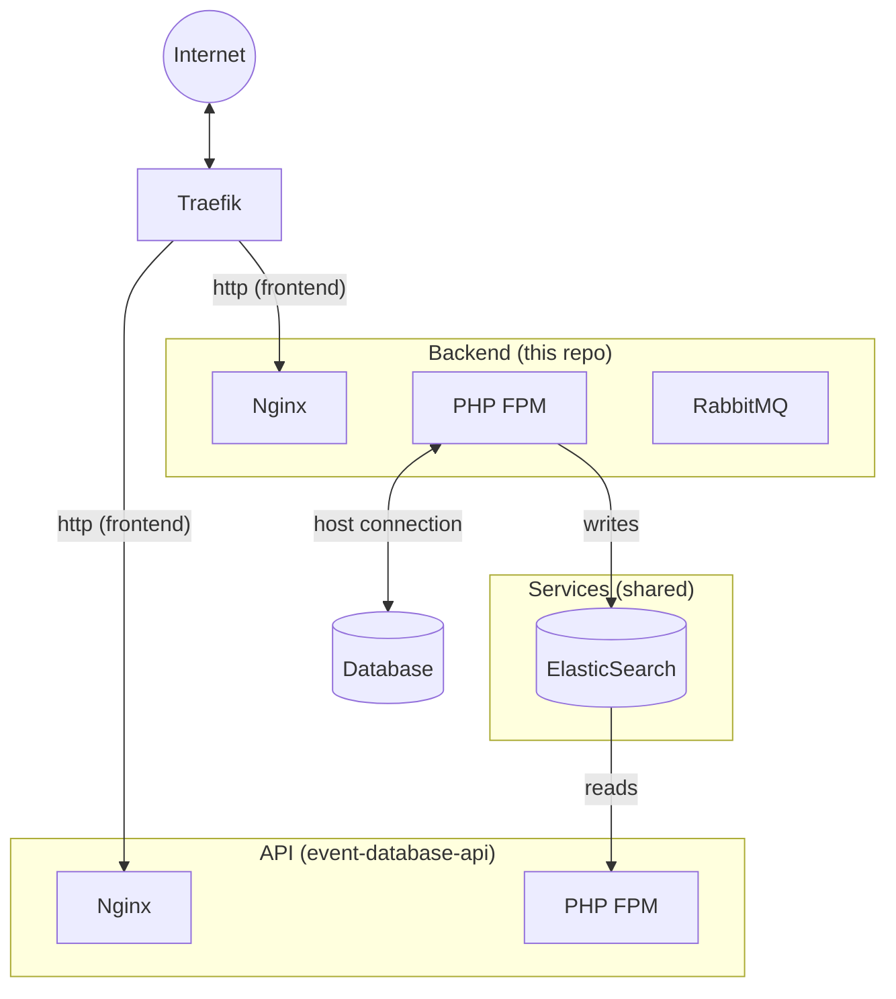

# Danish event database (version 2.x)

[![Woodpecker](https://img.shields.io/badge/woodpecker-prod|stg-blue.svg?style=flat-square&logo=)](https://woodpecker.itkdev.dk/repos/12)
[](https://github.com/itk-dev/event-database-imports/releases)
[](https://github.com/itk-dev/event-database-imports/actions/workflows/pr.yaml)
[](https://codecov.io/gh/itk-dev/event-database-imports)
[](https://github.com/itk-dev/event-database-imports/commits/develop/)
[](https://github.com/itk-dev/event-database-imports/blob/develop/LICENSE)

This is the next iteration of [the event database](https://github.com/itk-event-database/event-database-api) used by the
municipality of Aarhus.

The event database is an API platform for event aggregation from the public vendors throughout the cites. It gets data
mainly from feeds (JSON/XML) or APIs provided by the vendors. It is highly configurable in doing custom feed mappings
and extendable to read data from APIs and map this data to event. It also has a user interface to allow manual entering
of events.

The data input is pulled/pushed from a range of differently formatted sources and normalized into an event format that
can be used across platforms.

For more detailed and technical documentation, see the [docs](docs/README.md) folder in this repository.

## Record Architecture Decisions

This project utilizes record architecture decisions documents which can be located in [docs/adr](docs/adr) in this
repository.

## Installation

The application is built around Symfony and event messages for more information see the technical documentation in the
[docs](docs/README.md) folder in this repository.

```shell
docker compose pull
docker compose up --detach --remove-orphans
docker compose exec phpfpm composer install
docker compose exec phpfpm bin/console doctrine:migrations:migrate --no-interaction
docker compose exec phpfpm bin/console app:index:create
docker compose exec phpfpm bin/console messenger:setup-transports
```

> [!TIP]
> Pro tip: Run `task site:update` to run the above incantations in one go.

### Consume messages

In development, you need to consume messages by stating the consumer using the command below. Production setup uses the
supervisor container to automatically consume messages and process them. The service is defined in the
[docker-compose.server.override.yml](docker-compose.server.override.yml) composer file.

Manual consume messages with this command.

```shell
docker compose exec phpfpm bin/console messenger:consume async
```

### Load feeds

Import/read feeds and create events based on their data you need to set up cron jobs that with regular intervals execute
the command below. If you need to have different import intervals, you can add the database id of the feed you what to
run with `--id <id>`. If you want to loop over all feeds configured, omit the id parameter.

```shell
docker compose exec phpfpm bin/console app:feed:import
```

### Search index (front end data)

The front end [API](https://github.com/itk-dev/event-database-api) connects to ElasticSearch for fast event look up.
The index is automatically built when data is entered in the UI or feeds are parsed. But if you need to populate the
indexes, you can run this command:

```shell
docker compose exec phpfpm bin/console app:index:populate
```

This command is also helpful if the index gets out-of-sync with the database or if the index changes and needs
re-indexing.

### Fixtures

The project comes with doctrine fixtures to help development on local machines. They can be loaded with the standard
doctrine fixture load command:

```shell
docker compose exec phpfpm bin/console doctrine:fixtures:load
```

Or, using [Task](https://taskfile.dev) by running

```shell
task fixtures:load
```

After loading fixtures, you can sign (on `/admin/login`) in as one of these users:

| Username           | Password     | Roles        |
| ------------------ | ------------ | ------------ |
| `admin@itkdev.dk`  | `admin`      | `ROLE_ADMIN` |
| `tester@itkdev.dk` | `1233456789` | `ROLE_ADMIN` |

### Production

When installing composer and Symfony based application in production, you should not install development packages,
hence use this command:

```shell
docker compose exec phpfpm composer install --no-dev --optimize-autoloader
```

#### Recommend setup

Using all three repositories, you can create the setup depicted below and have communication between the backend
(imports) and the API (frontend) by using the
[shared service's repository](https://github.com/itk-dev/event-database-services.git).


```mermaid
flowchart TB
    internet(("Internet"))
    traefik["Traefik"]

    subgraph backend ["Backend (this repo)"]
        be_nginx["Nginx"]
        be_php["PHP FPM"]
        rabbit["RabbitMQ"]
    end

    subgraph services ["Services (shared)"]
        es[("ElasticSearch")]
    end

    subgraph api ["API (event-database-api)"]
        api_nginx["Nginx"]
        api_php["PHP FPM"]
    end

    db[("Database")]

    internet <--> traefik
    traefik -->|"http (frontend)"| be_nginx
    traefik -->|"http (frontend)"| api_nginx
    be_php -->|"writes"| es
    es -->|"reads"| api_php
    be_php <-->|"host connection"| db
```

## Roles and permissions

Sign-in is local username/password (Symfony `form_login`). Admin-UI authorization is enforced by voters in
`src/Security/Voter/` (keyed on EasyAdmin's per-action `EA_EXECUTE_ACTION` permission). Roles are defined in
`src/Types/UserRoles.php` and form an inheritance chain in `config/packages/security.yaml` — each role also holds
every capability of the roles to its right:

```text
SUPER_ADMIN → ADMIN → EDITOR → ORGANIZATION_ADMIN → ORGANIZATION_EDITOR → API_USER → USER
```

`ROLE_API_USER` is used by the read [`event-database-api`](https://github.com/itk-dev/event-database-api);
`ROLE_USER` is any authenticated user. In the matrix, "+" means "that role and everything above it".

| Entity       | View (index/detail) | Create                 | Edit                                                        | Delete                                    |
| ------------ | ------------------- | ---------------------- | ----------------------------------------------------------- | ----------------------------------------- |
| Organization | any user            | `EDITOR`+              | `EDITOR`+ · `ORGANIZATION_ADMIN` (own org)                  | `EDITOR`+                                 |
| Event        | any user            | `ORGANIZATION_EDITOR`+ | `EDITOR`+ · `ORGANIZATION_EDITOR` (own-org) — non-feed only | `EDITOR`+ (non-feed)                      |
| Location     | any user            | `EDITOR`+ ¹            | `EDITOR`+                                                   | `EDITOR`+ (only when it has no events)    |
| Address      | any user            | `EDITOR`+ ¹            | `EDITOR`+                                                   | `EDITOR`+ (only when it has no locations) |
| Tag          | any user            | any user ²             | `ADMIN`+                                                    | `ADMIN`+                                  |
| Vocabulary   | `ADMIN`+            | `ADMIN`+               | `ADMIN`+                                                    | `ADMIN`+                                  |
| Feed         | `ADMIN`+            | `SUPER_ADMIN`          | `SUPER_ADMIN`                                               | `SUPER_ADMIN`                             |
| Feed item    | `ADMIN`+            | — (import-managed) ³   | — ³                                                         | — ³                                       |
| User         | `ADMIN`+ or self    | `ADMIN`+               | `ADMIN`+ · others: self only                                | `ADMIN`+ (never your own account)         |

- **Feed-imported events are never editable or deletable** by anyone (ADR 007) — they change only via re-import.
- **Own-org scoping**: organization admins/editors may act only on entities belonging to their own organization(s).
- ¹ Organization admins can additionally create locations/addresses **inline** while creating an event (the save-action
  grant), even though the standalone `New` page is editor-gated.
- ² Anyone may create a bare tag, but assigning a tag to a vocabulary (the tag's `vocabularies` field) is `ADMIN`-only.
- **Vocabularies** (controlled tag vocabularies) are `ADMIN`-only for every action, enforced at the controller level
  (`VocabularyCrudController::configureActions()` via `setPermission`) rather than by a voter.
- **Feeds** are visible to `ADMIN`+ but only `SUPER_ADMIN` may create/edit/delete them; **Feed items** are read-only in
  the admin (create/edit/delete disabled) — they change only via feed import (ADR 007). Both are enforced via
  controller `setPermission`.
- **Occurrences** are edited inline within an event (an embedded CRUD), not as a standalone entity. The "My …" menu
  entries are organization-scoped views of Event/Organization for organization editors, not separate entities.
- Users are also gated by `UserEntityVoter` (`EA_ACCESS_ENTITY`): anonymous denied; `ADMIN`+ any user; otherwise own
  record only.

## Testing

The test suite is built on [PHPUnit](https://phpunit.de/) and split into two suites (see `phpunit.xml.dist`):

- **Unit** (`tests/Unit`) — isolated tests with no database, e.g. security voters and services.
- **Functional** (`tests/Functional`) — boot the kernel and exercise the app against a real database (authentication,
  admin CRUD, filters).

Run the whole suite with [Task](https://taskfile.dev):

```shell
task test
```

Or directly:

```shell
docker compose exec phpfpm vendor/bin/phpunit
```

`task test` runs `task test:setup` first, which provisions the isolated test database and migrates it before PHPUnit
starts. You can run that step on its own:

```shell
task test:setup
```

### Test database

Tests run against a dedicated `db_test` database, never the dev `db`, so a local run can never touch your development
data. Each test is wrapped in a transaction that is rolled back afterwards
([DAMA DoctrineTestBundle](https://github.com/dmaicher/doctrine-test-bundle)), and fixtures are loaded per test through
[Liip TestFixturesBundle](https://github.com/liip/LiipTestFixturesBundle).

Because the local `db` user cannot `CREATE DATABASE`, `task test:setup` creates and grants `db_test` as the database
root user (the fixed credentials from `docker-compose.yml`) and then migrates it. `task site:update` runs this as part
of local setup, so a fresh checkout is ready to test.

> [!NOTE]
> The test database name is fixed, so parallel execution with ParaTest is not supported. See
> [ADR 009 — Test database isolation](docs/adr/009-test-database-isolation.md) for the full rationale and trade-offs.

### Fixtures for functional tests

Functional tests load lightweight fixtures from `tests/Fixtures` (`TestUserFixtures`, `TestEventFixtures`) that create
users across roles and organisations, independent of the full development `EventFixture` chain.

### Coverage

`task test` writes a Clover report to `coverage/unit.xml` (uploaded to [Codecov](https://codecov.io/) in CI). Generating
coverage requires Xdebug, which the `test` task enables via `XDEBUG_MODE=coverage`.

## Development

Everything runs in Docker (`docker compose`); PHP, Composer and the Symfony console are only available inside the
`phpfpm` container. The application targets **PHP 8.4** and **Symfony 7.4**, with Doctrine ORM 3 / DBAL 4, EasyAdmin 5,
Elasticsearch 8 and Valinor 2. `composer.json` holds the authoritative version constraints.

### Coding standards & static analysis

[Task](https://taskfile.dev) wraps the tooling (each runs in the container or a dedicated lint service):

- `task coding-standards:check` / `:apply` — PHP (php-cs-fixer), Twig (twig-cs-fixer), Markdown (markdownlint) and
  YAML (prettier).
- `task code-analysis:phpstan` — PHPStan (level 8 + strict rules).
- `task code-analysis:rector` / `:rector:apply` — Rector (dry-run / apply).
- `task index:mappings:dump` — regenerate the committed Elasticsearch mapping exports in `resources/mappings/`.

### Continuous integration

Every pull request must pass these GitHub Actions gates (`.github/workflows/`):

- **`pr.yaml`** (Review) — composer validate + prod install, the full PHPUnit suite with coverage (→ Codecov),
  PHPStan, and `doctrine:schema:validate`.
- **`composer.yaml`** — `composer validate --strict`, `composer normalize --dry-run`, and `composer audit`.
- **`php.yaml`** — php-cs-fixer; **`twig.yaml`** — twig-cs-fixer; **`markdown.yaml`** — markdownlint;
  **`yaml.yaml`** — prettier `--check`.
- **`changelog.yaml`** — `CHANGELOG.md` must be updated in the PR.
- **`index-mappings.yaml`** — `resources/mappings/` must stay in sync with the mapping classes (fails if
  `task index:mappings:dump` was not re-run).

Tagged releases (`*.*.*`) are built by `build_release.yml`.
