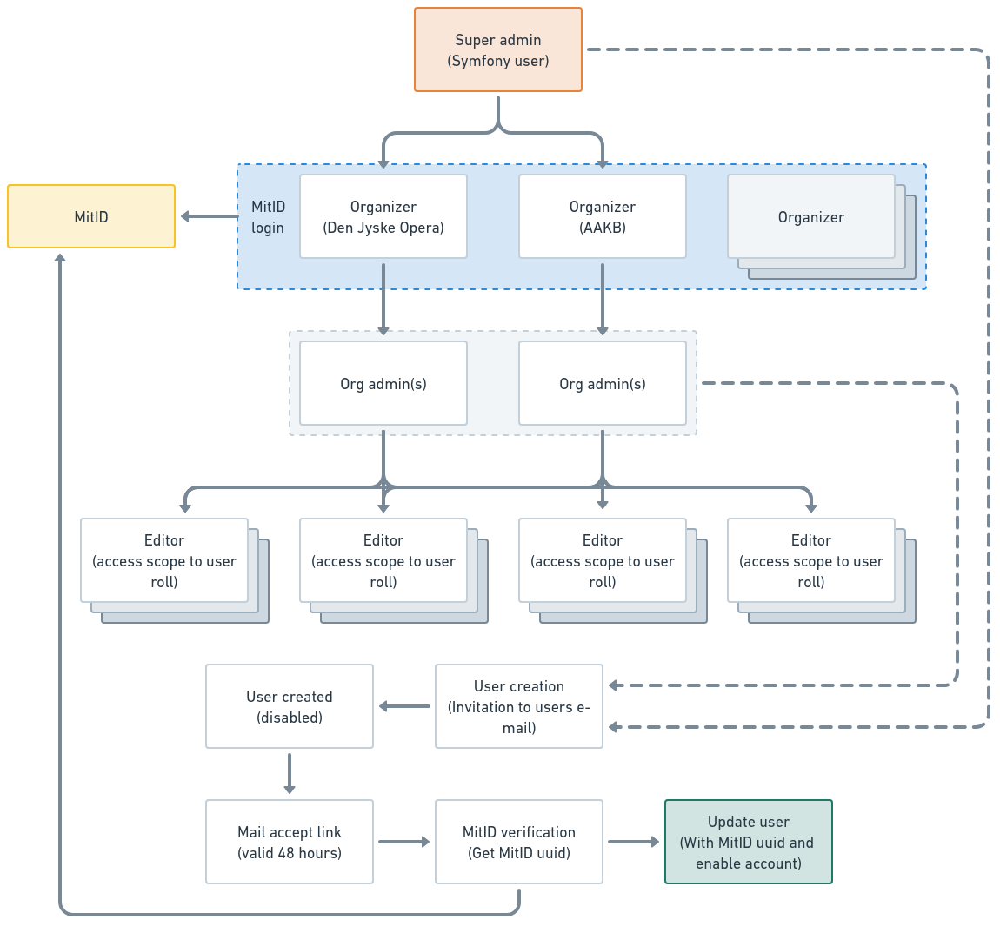
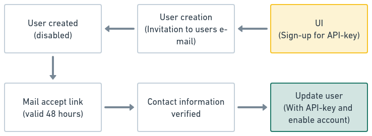

# Event database 2.0

This is the technical documentation for the project.

# Abstracted data flow

### Notes

* Clone events (UI)
* Soft delete
* Feed events not editable (feed is master)
* Tags (controlled and free (ukendt))
* Geo encoding filter
* Postel code filter (or filter)

# User handling

### Notes

* User expire
* User enable/disable (soft delete)
* Is context handler in play

# API access

