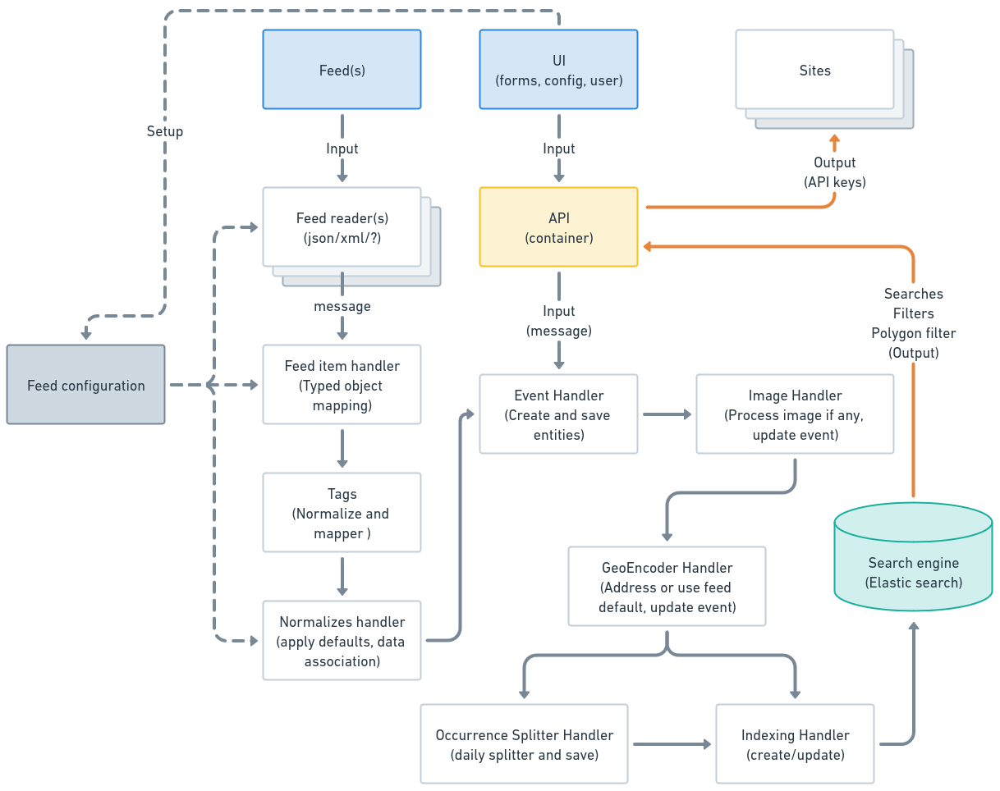
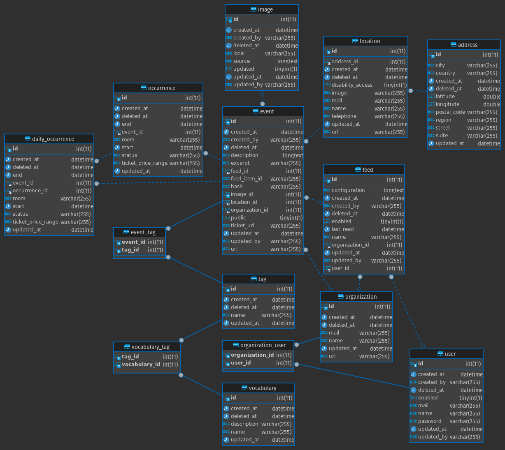

# Event database 2.0

This event platform is build using [Symfony](https://symfony.com/) with Symfony Messenger with RabbitMQ and
[API platform](https://api-platform.com/) with ElasticSearch.

This project tries to separate the write model from the read model for better performance and since the data in is from
different vendors that can be round independently of the user faced API. The architecture is based on
[CQRS](https://martinfowler.com/bliki/CQRS.html) with segregation between writing data and reading data.

The idea is that instances (docker containers) can be started for each vendor importing events by sending messages into
the message queue and workers processing the data (e.g. in other containers) and when data have been normalized it is
stored and index into ElasticSearch for fast data fetching (also enabling geospatial searching). This will also allow
the development of data importers in new vendors (e.g. fetching data from APIs) without any downtime for the frontend.

All data on this platform is soft deleted as base rule, we may make commands to purge data older than a relative given
date and thereby make hard deletions as deferred manual action.

## Abstracted data flow

This diagram tries to visualize the data flow for data in the system. This could be dived into the following containers
in a production setup.

* Vendors (feed readers/API consumers)
* Workers (handling import related messages)
* API
* UI (administrative and manual event creation)

### Implementation notes

In the administrative user interface the following should be possible:

* Create new events.
* Clone events (edit and save as new event).
* Only edit events created by current users organisations.
* All vendor imported events are not editable in the UI.

The API output should make it possible to:

* Geo encoding filter
* Postel code filter (or filter)

Things that requires more ivestigated:

* Tags (controlled and free (ukendt))
* Vendor ranking
* Duplicated content detection and handling (event hash, score)

## User handling

### Notes

* User expire
* User enable/disable (soft delete)
* Is context handler in play

## API access

## Entity model

